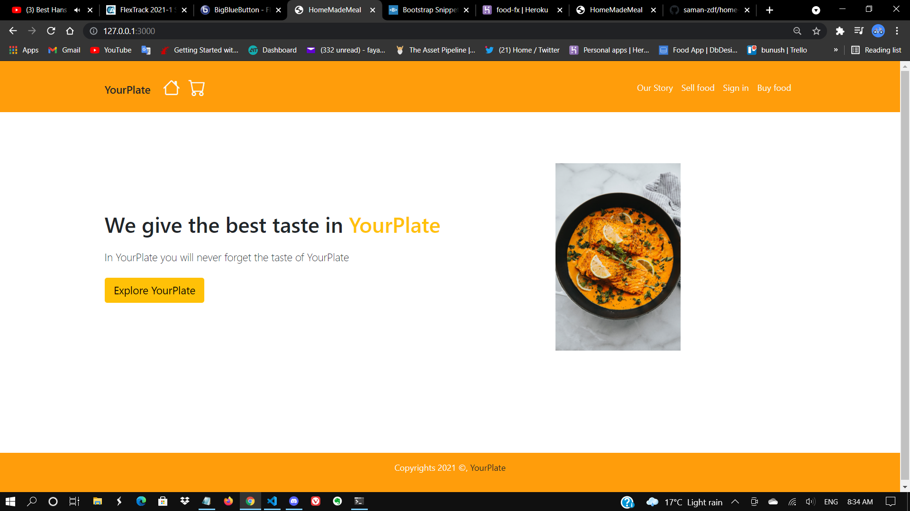

# Home made meal app

1. ## Identification of the problem you are trying to solve by building this particular marketplace app:

- Most people are busy during the day with a job and other tasks they could potentially have, and there is no time for them to have a good home made meal which can remind them of the family being together and having good tasty lunch or dinner. nowadays a lot of people because of lack of time, have to have fast food(some might call it junk food) to just make sure they fuel up for rest of the day and this might create a health issue in long run. with YourPlate application we will ensure the customers to get high quality home made food with fresh and local ingredient to have a best meal as if it has been mad in their own house. most of people prefer home mad cook, and we can provide the customer satsfaction by making the best home made meal for our consumers. this app can on the other hand help a lot of house wives to sart a new job as a home cook, which potentially can help them to have some side income. specially during pandemic a lot people has lost their job because of the pandemic and it can help them to get back to thier feed from their own house by cooking the food they love and sell it to customers.

---

2. ## Why is it a problem that needs solving?

- I have a look into it and just found not many application that could solve such a problem, this application can bring different benefit for people who will use this app. the people who got impacted by the pandemic and might lost their job could potentially have financial difficulty and spending most of their time in their house and have no solid income. they can simply cook a nice meal with one special ingredient which is love and sell it through this application. it will help them to have side incomes and if they enjoy cooking they are doing something they love. for the people who is the consumer, it will give them an option to have really tasty and healthy food which can remind them of good days of their life when they have been gathering with their family and having a good time with good meals. most people have no time to cook their food but still, they would love to have a nice meal for a day after work and through this application we can provide such a desire.

---

3. ## The Application link
   - [https://food-fx.herokuapp.com](https://food-fx.herokuapp.com/)
4. ## The Application Github repo
   - [Github Repository](https://github.com/saman-zdf/home-made-food)

---

5. ## Description of your marketplace app (website), including:

- Purpose:
  - The main purpose of this app is to give people the opportunity of having a job from their own house that can help them to have some income during pandemic and it also give some sellers who love cooking the option to do something they really love. it can give the customer the option to have a healty home made food instead of fast food, and it will be healthier to have a fresh home made meal. this app also will help the people who looking for work as a cook, it can be a starter for them to show their talent in cooking food.
- Functionality / features:
  - first feature is the authetication, the user will be able to create an account with email and password, the second feature, user after creating the account they will be able to create profile. the application has a two main user first is seller who will add the item for sell and the buyer who can buy the listed items.
    next feature is adding food item to the database, it needs that user has an account to be able to list the food item into the database, once the user account been created if the user is seller it will redirect the user to the food item list and will ask the user to put the details of their food in the food item list page, food item list contain name, description, type fo food, price, availability and upload image. after creating the food item, the food item will display the food card in the index page and it will be read to sell.
    the seller has a dashboard of the listed item and they can view how mnay items has been sold, and have an option to edit or delete their items.
    next feature is for the buyer if the user want to buy food they need to create a account as a buyer and also profile, once the buyer create thier account it will redirect them to the index page where they can choose food, also there is feature to search for the different type of foods, like Vegan or Vegetarian. if the buyer see the some food and they want to buy there is a feature that the buyer can add the chosen food to their shopping cart. the shoppimg cart will save the item to the session and once the buyer finish choosing their food it they can go to thier cart and check if they got everything they need and they will be able to remove some items if they change their mind. in the cart page there is checkout button and if the buyer choose to checkout it will redirect the buyer to the stripe payment gateway and the buyer can pay for their item via card. and once the chechout is successful it will redirect the buyer to the home page.
- Sitemap:
  - 
- Screenshots
  
  
  
  
  
- Target audience
  - The future employer, The people who wants to have a home made meal for thier daily food intake, the people who wants to have side incomes from their own house, my instructer at Coder Academy.
- Tech stack (e.g. html, css, deployment platform, etc)
- Ruby on Rails as a backend, html and css bootstrap as a frontend. I used the heroku for deploying the application. using the stripe as a third party for the payment gateway.

---

6. ## User story for the App

- As a user, I need to be able to have an personal account that I can use on this application
- As a user who sells food I would like to be able to list my food for the potential buyer have a description price, etc.
- As a user who buys I would like to be able to see the listed food item
- As a user who buys I would like to be able to have a functionality of filtering that gives me easier way of searching the type of food I'm looking for
- As a user who sells food I would like to be able to upload some food images that can attract the consumer to buy my food.
- As a user who buys I would like to be able to see some pictures of the food that ensures me what I'm buying
- As a user who sells food I would like to be able to delete the food item I've been listed or edit the food item or update it.
- As a user who buys I would like to see the food item gets updated regularly
- As a user who sells I would like to see the review of the customers and their feedback and also rating
- As a user who buys I would be able to leave a review on the food I bought and tell what I think about the food I bought from a specific seller, and also I would like to see the other buyers review and rating
- As a user, I would like to be to see if my food has been sold
- As a user who buys I would like to have an option to add food item into my shopping cart or remove form it
- A user who buys I would like to have an option to pay with my credit card through this application

---

7. ## Wireframe of the App
   
   
   
   
   
   
   
   
   
   

---

8. ## An ERD of the App

   1. ### Initial EDR
      
   2. ### Final Erd
      

9. ## Explain the different high-level components (abstractions) in your app
   - The app has the MVC pattern for the functionality of the models, contoller and views. The MVC architectural pattern will enforce sepration for the logic which is inputs and presentaion logic that associated with the browser.
   - Using several Ruby gems like, bootstrap, Devise, simple_form, stripe, ransack for have a better functionality in our app.
   - for the frontend I used mostly html and bootstrap css framework.
   - For database has been using the postgresql to store all the input that come from browser by the user.

---

10. ## Detail any third party services that your app will use

- Stripe: this is a third party payment processor and it can process each transaction through the application of different businesses in one merchant account(the account which accepts the different credit card for the payment). when the user sign up to the application they will instantly have a access to the stripe payment processing andd they do not need to go through all the step for opening the merchant account.
- Postgrsql database: the Ruby on Rails application by default using SQlite3 as a database which is a lightweight portable and user friendly in a low memory environment. but for the highly compldx applications which need more reliablity for the data integrity the postgresSQL is more flexible and robust. in PostgreSQL the server program is in charge of manage all the database files and accept any conection which comes from the client application. the postgres can handle several concurent connections from clients. it can executes all the request in the database from the client and send back the result back to the client.

- AWS S3 for uploading image: Amazon S3 is a web service that the developer can store or retrieve any data by using this web service. it is highly scalable and reliable and also cheap for data storaging. in this application we create a S3 bucket to reside all the image files that comes from the user. we needed to set up authetication and access control that only the bucket owner can have a access to the data inside the the aws.

---

11. ## Describe your projects models in terms of the relationships (active record associations) they have with each other

- first model is the user model which has been implemented by the devise gem and it has assocation with the profile table and each user model has one profile and profile table belongs to user, it has one-to-one connection.

```Ruby
# User model
class User < ApplicationRecord
  # Include default devise modules. Others available are:
  # :confirmable, :lockable, :timeoutable, :trackable and :omniauthable
  devise :database_authenticatable, :registerable,
         :recoverable, :rememberable, :validatable
  has_one :profile
end
# prodile model
class Profile < ApplicationRecord
  # the profile belong to the user and user will just have one profile
  belongs_to :user
end
```

- the second model is profile which have assocaition with user as mentioned above and also has a bi-directional-relation with food_item table, each profile can have many food_items and also it has a self join which distinguish the buyer and seller through the food_item model that each profile can have many food_item to sell or to buy with the food_item class and using the foreign key for seller_id or buyer_id. profile also have many comment t- recieve or tao make with food item table which the food tiem has a relation with commnet table. it also has a connection with active storage table that each profile can have one image.

```Ruby
class Profile < ApplicationRecord
  # profile has mnay food item, user can create as many food item
  has_many :food_item
  # user will have food item to sell for the join table which food tiem and seller id will be the foreign key for food item
  has_many :food_item_to_sell, class_name: "FoodItem", foreign_key: "seller_id"
  has_many :food_item_to_buy, class_name: "FoodItem", foreign_key: "buyer_id"
  # user can have many comment as buyer to make and as a seller to recieve
  has_many :comments_to_make, class_name: "FoodItem", foreign_key: "buyer_id"
  has_many :comments_to_receive, class_name: "FoodItem", foreign_key: "seller_id"
  has_one_attached :image
end

```

- third model is food item table, that belongs_to profile, belongs_to buyer with class of profile and also to the seller, the food item has many line_items that will be stored in the cart, food item a relation with the active storage table which can has many images through active storage table. food item can have many comments.

```ruby
class FoodItem < ApplicationRecord
  # profile belongs to the fooditem and profile is a foreign key in the fooditem table
  belongs_to :profile
  # food item belong to the buyer with profile, but for the user it will be optional to be a buyer
  belongs_to :buyer, class_name: "Profile", optional: true
# food item also belongs ot the seller, but for the seller in order to create food item list, the seller has to exist buy havinfg an account and creating a profile
  belongs_to :seller, class_name: "Profile"
  has_many :line_items
  before_destroy :ensure_not_referenced_by_any_line_item
  # using enum to have a differnt type of food or diet, and useing select in the form for the food item
  # this is for uploading an image, this will tell that we have many image to upload, we pass the attribute as a params in food item controller to be able for uploading the image, it can have multiple image for every food item,
  has_many_attached :images, dependent: :destroy
  #
  has_many :comments
  private
    def ensure_not_referenced_by_any_line_item
      unless line_items.empty?
        errors.add(:base, 'Line Items present')
        throw :abort
      end
    end
end
```

- fourth model is line_items, which belongs to the cart model and also to the food item model

```ruby
class LineItem < ApplicationRecord
  belongs_to :food_item
  belongs_to :cart
  def total_price
    food_item.price * quantity
  end
end

```

- fifth model is cart, each cart can has many line items through line items we can add many line_items which has a items from food items inot the cart model.

```ruby
class Cart < ApplicationRecord
  has_many :line_items, dependent: :destroy
  # the add_food_item method will check if the list of items already includes the item we adding, if it does it will show the quantity and if it doesn't it will build a new line items for the user
  def add_food_item(food_item)
    current_item = line_items.find_by(food_item_id: food_item.id)
      if current_item
        # I couldn't do increment by adding current_item.quantity += 1, for "+" it would return an error for undifined method for "+", I used increment bulit in method from ruby and it workd fine
        current_item.increment!(:quantity)
      else
        current_item = line_items.build(food_item_id: food_item.id)
      end
    current_item
  end
  def total_price
    line_items.to_a.sum {|item| item.total_price}
  end
end
```

- last model is comment, it belongs to the food_item and for each food item buyer or seller can make many comments

```ruby
class Comment < ApplicationRecord
  belongs_to :food_item
end
```

---

12. ## Discuss the database relations to be implemented in your application

---
