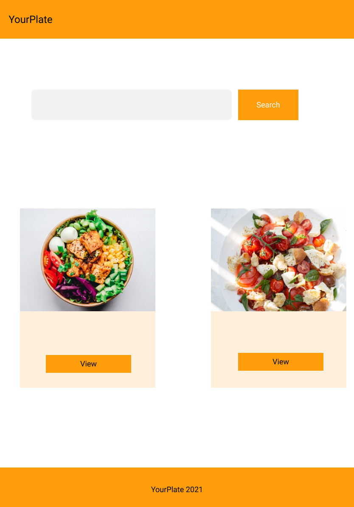

# YourPlate

## Identification of the problem you are trying to solve by building this particular marketplace app:

- Most people are busy during the day with a job and other tasks they could potentially have, and there is no time for them to have a good home made meal which can remind them of the family being together and having good tasty lunch or dinner. nowadays a lot of people because of lack of time, have to have fast food(some might call it junk food) to just make sure they fuel up for rest of the day and this might create a health issue in long run. with YourPlate application we will ensure the customers to get high quality home made food with fresh and local ingredient to have a best meal as if it has been mad in their own house. most of people prefer home mad cook, and we can provide the customer satsfaction by making the best home made meal for our consumers.A lot of people have lost their job due to the pandemic. They are stuck at home cooking and eating. YourPlate helps people to earn an income from home by providing cooked meals to others, and provides healthier and tastier options for users who currently can generally only order fast food. Home cooked food can warm the soul. It is food cooked with love. YourPlate will remind people of family gatherings and good times.

---

## Why is it a problem that needs solving?

- I have a look into it and just found not many application that could solve such a problem, this application can bring different benefit for people who will use this app. the people who got impacted by the pandemic and might lost their job could potentially have financial difficulty and spending most of their time in their house and have no solid income. they can simply cook a nice meal with one special ingredient which is love and sell it through this application. it will help them to have side incomes and if they enjoy cooking they are doing something they love. for the people who is the consumer, it will give them an option to have really tasty and healthy food which can remind them of good days of their life when they have been gathering with their family and having a good time with good meals. most people have no time to cook their food but still, they would love to have a nice meal for a day after work and through this application we can provide such a desire.

---

## The Application link

- [https://food-fx.herokuapp.com](https://food-fx.herokuapp.com/)

## The Application Github repo

- [Github Repository](https://github.com/saman-zdf/home-made-food)

---

## Description of your marketplace app (website), including:

- Purpose:
  - The main purpose of this app is to give people the opportunity of having a job from their own house that can help them to have some income during pandemic and it also give some sellers who love cooking the option to do something they really love. it can give the customer the option to have a healty home made food instead of fast food, and it will be healthier to have a fresh home made meal. this app also will help the people who looking for work as a cook, it can be a starter for them to show their talent in cooking food.
- Functionality / features:
  - first feature is the authetication, the user will be able to create an account with email and password, the second feature, user after creating the account they will be able to create profile. the application has a two main user first is seller who will add the item for sell and the buyer who can buy the listed items.
    next feature is adding food item to the database, it needs that user has an account to be able to list the food item into the database, once the user account been created if the user is seller it will redirect the user to the food item list and will ask the user to put the details of their food in the food item list page, food item list contain name, description, type fo food, price, availability and upload image. after creating the food item, the food item will display the food card in the index page and it will be read to sell.
    the seller has a dashboard of the listed item and they can view how mnay items has been sold, and have an option to edit or delete their items.
    next feature is for the buyer if the user want to buy food they need to create a account as a buyer and also profile, once the buyer create thier account it will redirect them to the index page where they can choose food, also there is feature to search for the different type of foods, like Vegan or Vegetarian. if the buyer see the some food and they want to buy there is a feature that the buyer can add the chosen food to their shopping cart. the shoppimg cart will save the item to the session and once the buyer finish choosing their food it they can go to thier cart and check if they got everything they need and they will be able to remove some items if they change their mind. in the cart page there is checkout button and if the buyer choose to checkout it will redirect the buyer to the stripe payment gateway and the buyer can pay for their item via card. and once the chechout is successful it will redirect the buyer to the home page.
- Sitemap:
  - 
- Screenshots
  
  
  
  
  
- Target audience
  - The future employer, The people who wants to have a home made meal for thier daily food intake, the people who wants to have side incomes from their own house, my instructer at Coder Academy.
- Tech stack (e.g. html, css, deployment platform, etc)
- Ruby on Rails as a backend, html and css bootstrap as a frontend. I used the heroku for deploying the application. using the stripe as a third party for the payment gateway.

---

## User story for the App

- As a user, I need to be able to have an personal account that I can use on this application
- As a user who sells food I would like to be able to list my food for the potential buyer have a description price, etc.
- As a user who buys I would like to be able to see the listed food item
- As a user who buys I would like to be able to have a functionality of filtering that gives me easier way of searching the type of food I'm looking for
- As a user who sells food I would like to be able to upload some food images that can attract the consumer to buy my food.
- As a user who buys I would like to be able to see some pictures of the food that ensures me what I'm buying
- As a user who sells food I would like to be able to delete the food item I've been listed or edit the food item or update it.
- As a user who buys I would like to see the food item gets updated regularly
- As a user who sells I would like to see the review of the customers and their feedback and also rating
- As a user who buys I would be able to leave a review on the food I bought and tell what I think about the food I bought from a specific seller, and also I would like to see the other buyers review and rating
- As a user, I would like to be to see if my food has been sold
- As a user who buys I would like to have an option to add food item into my shopping cart or remove form it
- A user who buys I would like to have an option to pay with my credit card through this application

---

## User journey

1. Seller

- User as a seller need to create an account
- user as a seller need to create a profile
- user as a seller if the user wants to sell any item like food needs to input the details of the food item.
- User as a seller can edit the food item user has to create or delete it.
- User as a seller can buy the other's food if he/she wish to.

2. Buyer

- User as a buyer need to create an account
- User as a buyer need to create a profile
- User as a buyer can search the food item
- User as a buyer can add the item to the cart
- User as a buyer can delete items from the cart
- User as a buyer has an ability to checkout and pay for the food he/she chose.

3. Guest user

- User as a guest can search for the item
- User as a guest can browse through app
- User as a guest can't buy or sell anything unless creating an account

---

## Wireframe of the App





---

## An ERD of the App

1.  ### Initial EDR
    

## Explain the different high-level components (abstractions) in your app

- The app has the MVC pattern for the functionality of the models, controller, and views. The MVC architectural pattern will enforce separation for the logic which is inputs and presentation logic associated with the browser.
- if the user wants to sell food through this app by clicking the sell food link the view send a request to the food item controller and in the controller new action send a request to the food item model to filling the attributes of the corresponding model, if the user has an account and created a profile user can create a food item list, if not in the new action there is a condition the user needs to have a profile it will send a request to the profile model to let the user fill the attributes of the table of the corresponding model and will send a response to the controller and from profile controller will response goes back to the user to create a profile. the same procedure will take action for the creating account. once the step above is done the food item has been created from the home controller we query all the food items from the food item model and will show it from index action to the index HTML.
  if the user is the buyer and he wants to buy an item, the user needs to create an account, we set the user type for the buyer and if the user type is buyer user just need to create an account and profile which the request goes first to devise which is responsible to create an account and then an application controller, we check if the user type is buyer create and profile, where the request goes to the profile controller and from new profile, action request goes to the profile model to get permission to fill the attributes of the corresponding table, once all the step is done, now the user buyer can choose an item an added to their cart. if the user chooses to add an item to the cart the request first goes to line items in creating action to get the specific food item id and added to the cart. from there if the user wants to check out the request goes to the payment controller to create action where it calls for the stripe API to do the money transaction and will add the item to the list of the sold item.
- Using several Ruby gems like bootstrap, Devise, simple_form, stripe, ransack, rolify, cancancan to have more features and functionality within the app.
- for the frontend, I used mostly HTML and bootstrap CSS framework.
- For database has been using PostgreSQL to store all the input that comes from a browser by the user.

---

## Detail any third party services that your app will use

- Stripe: this is a third-party payment processor and it can process each transaction through the application of different businesses in one merchant account(the account which accepts the different credit card for the payment). when the user signs up to the application they will instantly have access to the stripe payment processing and they do not need to go through all the steps for opening the merchant account.
- PostgreSQL database: the Ruby on Rails application by default uses SQlite3 as a database which is lightweight portable and user-friendly in a low memory environment. but for the highly complex applications which need more reliability for data integrity, PostgreSQL is more flexible and robust. in PostgreSQL, the server program is in charge of manage all the database files and accept any connection which comes from the client application. the Postgres can handle several concurrent connections from clients. it can execute all the requests in the database from the client and send the result back to the client.

- AWS S3 for uploading an image: Amazon S3 is a web service that the developer can store or retrieve any data by using this web service. it is highly scalable and reliable and also cheap for data storage. in this application we create an S3 bucket to reside all the image files that comes from the user. we needed to set up authentication and access control that only the bucket owner can have access to the data inside the aws. once all the step is done we need to get the access secret key and secret key to put them in the credentials file to have the access to the bucket for uploading the files.

---

## Describe your projects models in terms of the relationships (active record associations) they have with each other

- first model is the user model which has been implemented by the devise gem and it has an association with the profile table and each user model has one profile and the profile table belongs to the user, it has a one-to-one connection.

```Ruby
# User model
class User < ApplicationRecord
  rolify
  # Include default devise modules. Others available are:
  # :confirmable, :lockable, :timeoutable, :trackable and :omniauthable
  devise :database_authenticatable, :registerable,
         :recoverable, :rememberable, :validatable
  has_one :profile
end
# prodile model
class Profile < ApplicationRecord
  # the profile belong to the user and user will just have one profile
  belongs_to :user
end
```

- the second model is a profile that has an association with the user as mentioned above and also has a bi-directional-relation with food_item table, each profile can have many food_items, and also it has a self join which distinguish the buyer and seller through the food_item model that each profile can have many food_item to sell or to buy with the food_item class and using the foreign key for seller_id or buyer_id. the profile also has many comments t- receive or tao make with food item table which the food item has a relation with comment table. it also has a connection with an active storage table that each profile can have one image.

```Ruby
class Profile < ApplicationRecord
  # profile has mnay food item, user can create as many food item
  has_many :food_item
  # user will have food item to sell for the join table which food tiem and seller id will be the foreign key for food item
  has_many :food_item_to_sell, class_name: "FoodItem", foreign_key: "seller_id"
  has_many :food_item_to_buy, class_name: "FoodItem", foreign_key: "buyer_id"
  # user can have many comment as buyer to make and as a seller to recieve
  has_many :comments_to_make, class_name: "FoodItem", foreign_key: "buyer_id"
  has_many :comments_to_receive, class_name: "FoodItem", foreign_key: "seller_id"
  has_one_attached :image
end

```

- third model is the food item table, that belongs_to profile, belongs_to buyer with the class of profile and also to the seller, the food item has many line_items that will be stored in the cart, food item a relation with the active storage table which can have many images through active storage table. food items can have many comments.

```ruby
class FoodItem < ApplicationRecord
  # profile belongs to the fooditem and profile is a foreign key in the fooditem table
  belongs_to :profile
  # food item belong to the buyer with profile, but for the user it will be optional to be a buyer
  belongs_to :buyer, class_name: "Profile", optional: true
# food item also belongs ot the seller, but for the seller in order to create food item list, the seller has to exist buy havinfg an account and creating a profile
  belongs_to :seller, class_name: "Profile"
  has_many :line_items
  before_destroy :ensure_not_referenced_by_any_line_item
  # using enum to have a differnt type of food or diet, and useing select in the form for the food item
  # this is for uploading an image, this will tell that we have many image to upload, we pass the attribute as a params in food item controller to be able for uploading the image, it can have multiple image for every food item,
  has_many_attached :images, dependent: :destroy
  #
  has_many :comments
  private
    def ensure_not_referenced_by_any_line_item
      unless line_items.empty?
        errors.add(:base, 'Line Items present')
        throw :abort
      end
    end
end
```

- fourth model is line_items, which belongs to the cart model and also to the food item model

```ruby
class LineItem < ApplicationRecord
  belongs_to :food_item
  belongs_to :cart
  def total_price
    food_item.price * quantity
  end
end

```

- fifth model is a cart, each cart can have many line items through line items we can add many line_items which have items from food items into the cart model.

```ruby
class Cart < ApplicationRecord
  has_many :line_items, dependent: :destroy
  # the add_food_item method will check if the list of items already includes the item we adding, if it does it will show the quantity and if it doesn't it will build a new line items for the user
  def add_food_item(food_item)
    current_item = line_items.find_by(food_item_id: food_item.id)
      if current_item
        # I couldn't do increment by adding current_item.quantity += 1, for "+" it would return an error for undifined method for "+", I used increment bulit in method from ruby and it workd fine
        current_item.increment!(:quantity)
      else
        current_item = line_items.build(food_item_id: food_item.id)
      end
    current_item
  end
  def total_price
    line_items.to_a.sum {|item| item.total_price}
  end
end
```

- Comment model, belongs to the food_item, and for each food item buyer or seller can make many comments, and only the admin will have the ability to delete any comments

```ruby
class Comment < ApplicationRecord
  belongs_to :food_item
end
```

- The ability model is coming from cancancan gem and in this model, we can specify users can have different types of roles within the app, for example only the admin can delete the comments from the comment list.

```Ruby
class Ability
  include CanCan::Ability
  def initialize(user)
      user ||= User.new # guest user (not logged in)
      if user.has_role? :admin
        can :manage, :all
      else
        can :read, :all
      end
  end
end
```

---

- The role model is the model for rolify gem and it has and belong to many user, from user table we can create our admin and associate ti with role model

```Ruby
class Role < ApplicationRecord
  has_and_belongs_to_many :users, :join_table => :users_roles

  belongs_to :resource,
             :polymorphic => true,
             :optional => true


  validates :resource_type,
            :inclusion => { :in => Rolify.resource_types },
            :allow_nil => true

  scopify
end
```

---

## Discuss the database relations to be implemented in your application

- User table has two associations. 1. has many and belong to the role table, 2. has only one profile
- Profile table has 4 associations. 1. it belongs to the user, 2. it has a lot of food, also it has many food items to sell with the class of food item, and a foreign key of seller_id, and has many to buy with the class of food items and the foreign key of buyer_id. 3. it has many comments to make with the class of comments which is a join table as a class of food_item with a foreign key of buyer_id. 4. it has one attached image from the active storage table.
- FoodItem table has 4 associations, 1. it belongs to profile, 2. it belongs to the buyer with the profile class, it belongs to the seller with the profile class as a join table. 3. it has many line_items. 4. it has many attached images from active storage tables. 5. it has many comments.
- LineItem table has 2 associations. 1. it belongs to the food_item table. 2. it belongs to the cart table.
- Cart table has 1 association. it has many line items and it is dependent on destroying.
- Comment table has only one associated with the food item table.
- Role table has 2 associations. 1. it has and belongs to the user table. 2. it belongs to the resources(which I don't know how does this work)

---

## Provide your database schema design


---

## Describe the way tasks are allocated and tracked in your project

1. I start it with planning and brainstorming to come up with the idea and once I knew what I'm going to build I start it with my project
2. I made the wireframe but I had to change some of the things in the app along the way, that's when my wireframe had to be changed.
3. I used Trello for project management, first I wrote down my user story, once the user story was done, it had to start and make a basic of my app line the boilerplate of the app the basic gem the app needed, and so on. next I start to create a card for the feature or the functionality I was planning on and for each of them I create a card in Trello and put them in the to-do section. I start it with a user model which I used devise gem and finished it with a comment model. I also create 3 extra sections of reminder, blocker, and resolved. a reminder was to remind me if there an extra details I should add to my features. blocker was for if anything I would get stuck on I would put the details in the blocker and once it was resolved I would move it to the resolved section and put a comment as an explanation of how the issue got solved. it helped me to have a better understanding of the issue later on.
4. each time if I would implement a new feature I would test it first to see it works the way is expected and then if my test would be ok, I stage the commit to the git and then would push my code to GitHub.

- 
- 
- 
- 
- 
